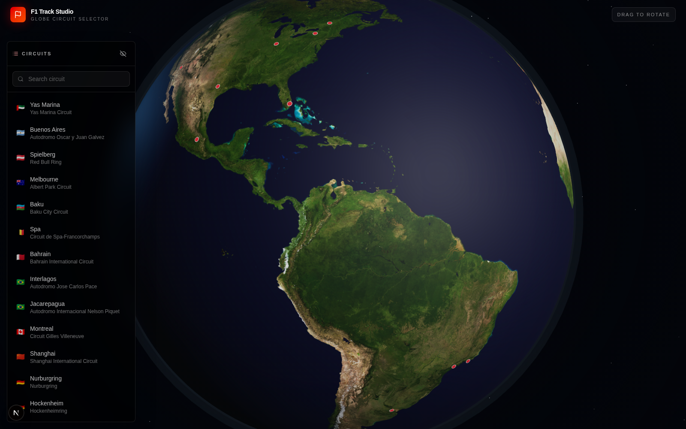
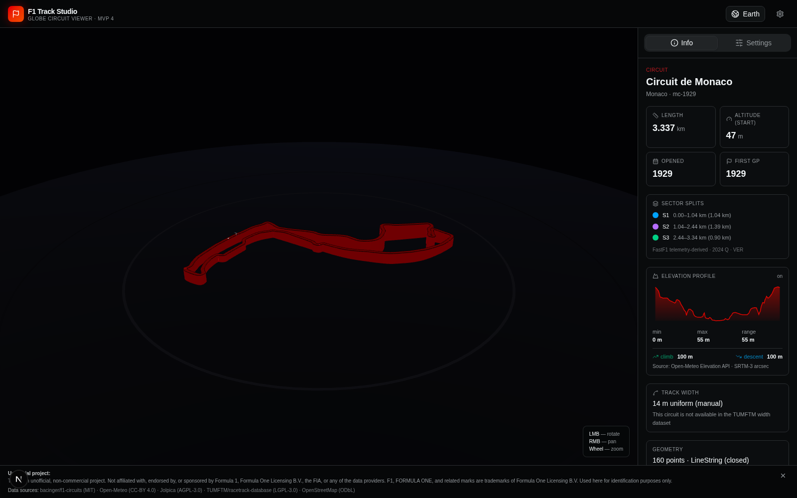

# F1 Track Studio

Interactive Formula 1 circuit explorer built with Next.js, React Three Fiber, and Three.js.

MVP 4 adds a globe-first entry flow: open the site, rotate a textured Earth, pick an F1 circuit marker, and jump into the detailed 3D TrackViewer.





## Highlights

- **Globe circuit selector** with local Earth textures, compact markers, search, desktop sidebar, and mobile circuit panel.
- **No runtime map APIs** for the globe. Earth assets live under `public/textures/earth/`.
- **3D TrackViewer** for existing `?track=...` URLs, with the original track experience preserved.
- **Static circuit data** from `bacinger/f1-circuits`, plus a local `public/circuits-index.json` for globe marker placement.
- **Real elevation profiles** from pre-generated static JSON, with Open-Meteo/OpenTopoData fallback logic.
- **Sector overlays** from FastF1 telemetry or manually verified sector distances.
- **Real per-point track width** for supported modern circuits using TUMFTM racetrack data.
- **Static environment layers** for generated circuit dioramas: terrain, roads, water, buildings, landuse, and surface data.
- **Shareable URLs** for track, width, elevation, sector, environment, terrain, and real-width state.
- **Dark F1-style UI**, English/Russian dictionaries, responsive desktop and mobile layouts.

## How It Works

Opening `/` with no `track` query param shows the globe landing page.

Opening a URL with `?track=...` renders the existing TrackViewer directly:

```txt
/?track=es-1991&width=7&elevation=1&sectors=0&realwidth=0&environment=1&terrain=1
```

Selecting a circuit on the globe does not replace the viewer. It only previews the circuit and offers an `Open Circuit` action that navigates to the existing TrackViewer route.

## Local Development

Requirements:

- Bun 1.1+ or Node.js 20+
- A modern browser with WebGL

```bash
bun install
bun run dev
```

Open:

```txt
http://localhost:4000
```

## Scripts

| Command | Purpose |
|---|---|
| `bun run dev` | Start the Next.js dev server on port 4000 |
| `bun run build` | Production build |
| `bun run build:pages` | Static export for GitHub Pages |
| `bun run lint` | ESLint |
| `bun run elevations:generate` | Generate static elevation JSON files |
| `bun run widths:generate` | Generate TUMFTM real-width profiles |
| `bun run environment:generate` | Generate static environment bundles |

## Project Layout

```txt
src/
  app/
    page.tsx                 # Routes globe vs TrackViewer based on ?track=
  components/
    globe/                   # Globe landing, Earth scene, markers, info card
    track-viewer.tsx         # Main Three.js circuit renderer
    track-side-panel.tsx     # Desktop info/settings panel
    track-settings-panel.tsx # Camera, layers, terrain, width controls
    mobile-info-sheet.tsx    # Mobile TrackViewer info panel
    ui/                      # shadcn/ui components
  hooks/
    use-circuts.ts           # Circuit index loading + URL initial selection
    use-track-data.ts        # GeoJSON + elevation loading
  lib/
    f1-circuits.ts           # Circuit metadata helpers
    track-geometry.ts        # Ribbon/mesh geometry builders
    track-width.ts           # TUMFTM width-profile loader
    environment-loader.ts    # Static environment bundle loader
    i18n.ts                  # English/Russian dictionaries
public/
  circuits-index.json        # Globe circuit marker index
  elevations/                # Static elevation profiles
  environments/              # Static diorama/environment bundles
  textures/earth/            # Local Earth texture assets
docs/
  architecture.md
  earth-textures.md
  screenshots/
```

## Earth Textures

The globe looks for:

```txt
public/textures/earth/earth-day.jpg
public/textures/earth/earth-clouds.png   # optional
public/textures/earth/earth-night.jpg    # reserved for future night-side work
```

Use equirectangular Earth maps. A 2048 or 4096 pixel wide JPG/WebP is a good first target. Avoid huge 16k/32k files for initial load and GitHub Pages.

## Data Sources

| Source | Used for | License |
|---|---|---|
| [bacinger/f1-circuits](https://github.com/bacinger/f1-circuits) | Track geometry and metadata | MIT |
| [Open-Meteo](https://open-meteo.com/en/docs#elevation-api) | Elevation data | CC-BY 4.0 |
| [OpenTopoData](https://opentopodata.org/) | Elevation fallback | CC-BY 4.0 |
| [TUMFTM/racetrack-database](https://github.com/TUMFTM/racetrack-database) | Real per-point track width | LGPL-3.0 |
| [OpenStreetMap](https://www.openstreetmap.org/copyright) | Generated environment layers | ODbL |

## Disclaimer

Unofficial, non-commercial project. Not affiliated with, endorsed by, or sponsored by Formula 1, Formula One Licensing B.V., the FIA, or any data provider. F1, FORMULA ONE, and related marks are trademarks of Formula One Licensing B.V. Used here for identification purposes only.

## License

MIT. See [LICENSE](LICENSE).
