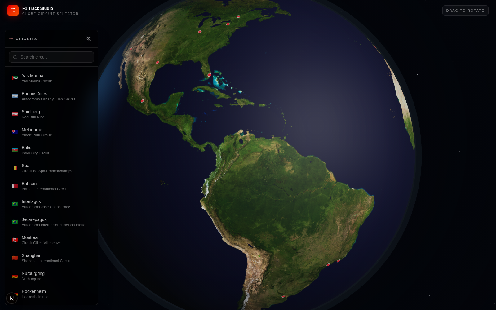
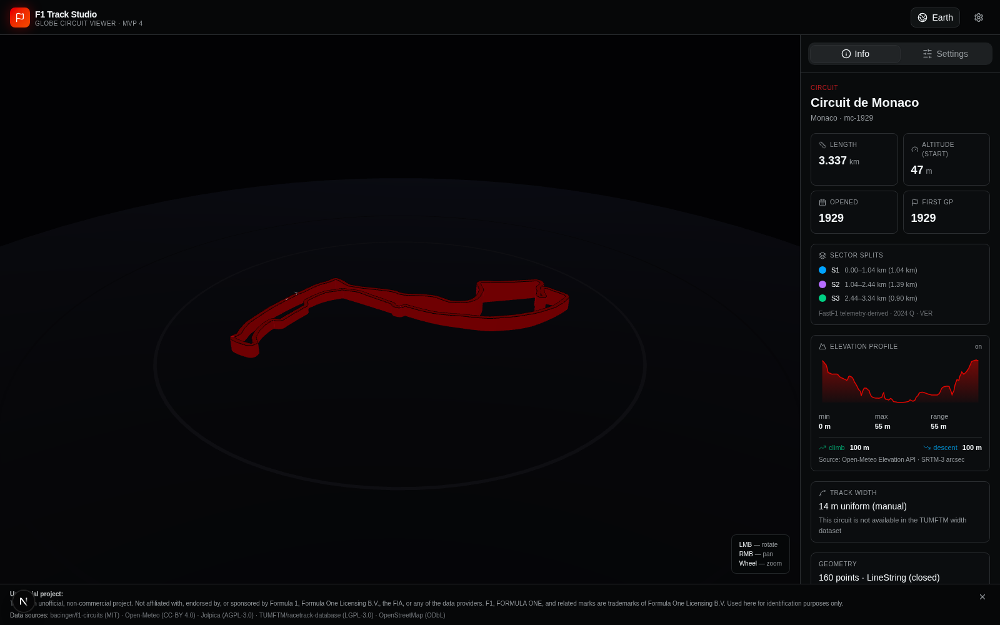

# F1 Track Studio

Interactive Formula 1 circuit explorer built with Next.js, React Three Fiber, and Three.js.

Pick a circuit from a textured globe, look at it as a 3D diorama with real elevation
and a real city around it, then start a race on it and watch twenty cars drive the lap.





## What it does

**Globe.** A textured Earth with a marker per circuit, search, and a preview card.
Earth assets are local — no runtime map APIs.

**Track viewer.** The circuit as a 3D ribbon: real elevation, sector overlays, real
per-point width where the data exists, and an optional diorama of the terrain,
buildings, water, roads and landuse around it.

**Race view.** The same circuit rendered as asphalt rather than a schematic — kerbs
derived from the centerline's curvature, the paved apron they sit on, painted grid
boxes, a start-light gantry — with twenty cars on it. The simulation is deterministic:
a per-circuit seed fixes the grid order, each car's pace, and its reaction to the
lights, so the same link always shows the same race. A timing tower carries the
running order, gaps timed off each car's own trace, laps and fastest lap. Speed runs
from 1x to 16x, and "to the flag" runs the remaining distance without drawing it.

Everything is a URL:

```txt
/?track=es-1991&width=7&elevation=1&sectors=0&realwidth=0&environment=1&terrain=1&quality=auto
/?track=mc-1929&race=1
```

`/` with no `track` opens the globe. `/admin` is a local tool for inspecting car
models and the instanced fleet.

## Local development

Requirements: Bun 1.1+ or Node.js 20+, and a browser with WebGL.

```bash
bun install
bun run dev     # http://localhost:4000
```

## Scripts

| Command | Purpose |
|---|---|
| `bun run dev` | Dev server on port 4000 |
| `bun run build` | Production build |
| `bun run build:pages` | Static export for GitHub Pages |
| `bun run lint` | ESLint |
| `bun run test` | Invariant tests on synthetic ground — no network, milliseconds |
| `bun run elevations:generate` | Static elevation profiles |
| `bun run widths:generate` | TUMFTM real-width profiles |
| `bun run environment:generate` | Diorama bundles (terrain, buildings, water, roads) |
| `bun run cars:teams` | Team liveries from the base car model |
| `bun run cars:lods` | Reduced-triangle car models |
| `bun run cars:generate` | Car manifest |
| `bun run race:laptimes` | Compare the speed model's ideal lap against real pole laps |
| `bun run race:audit` | Headless race, checking the field stays sane |
| `bun run race:kerbs` | Corner detection coverage across the calendar |
| `bun run race:gaps` | Timing-tower gaps against a headless race |

The generators need Python with `fastf1` and `pandas` for the telemetry-derived
sector splits; everything they produce is committed under `public/`, so running the
app never touches them.

## Layout

```txt
src/
  app/                       Next.js routes: / and /admin
  components/
    globe/                   Earth, markers, circuit preview
    track/                   viewer UI — panels, sheets, settings, circuit list
    race/                    race HUD — timing tower, controls, results, lights
    three/                   every R3F component: track mesh, cars, camera rig,
                             environment layer, studio stage
    admin/                   model and fleet inspection tools
    ui/                      shadcn/ui primitives
  hooks/                     circuit index, track data, race simulation, lights
  lib/
    track/                   centerline geometry, curvature, corners, kerbs,
                             apron, width, markers, start/finish, elevation
    race/                    simulation, speed profile, grid, drivers, teams
    cars/                    car dimensions, mesh building, model stats
    env/                     diorama bundles, terrain sampling, palette
    (root)                   geo-utils, url-state, i18n, scene-config, prefs
public/
  circuits-index.json        globe marker index
  elevations/                static elevation profiles
  environments/              per-circuit diorama bundles
  track-markers/             sector splits, start/finish, lap length
  track-widths/              TUMFTM width profiles
  cars/                      car models per team, with LODs
  textures/earth/            Earth textures
docs/
  architecture.md            how the app runs
  project-map.md             where things live, by symptom
  scene-goals.md             what the baked scene must be, and its invariants
  roadmap.md                 what is next, in priority order
  history/                   what already happened: P0–P4, and the ground work
  city-generation.md         why the bake is shaped this way (D1-D17)
  history/                   what was already built, phase by phase
```

## Earth textures

```txt
public/textures/earth/earth-day.jpg
public/textures/earth/earth-clouds.png   # optional
public/textures/earth/earth-night.jpg    # reserved
```

Equirectangular maps, 2048 or 4096 px wide. Avoid 16k files — they have to load over
GitHub Pages.

## Data sources

| Source | Used for | License |
|---|---|---|
| [bacinger/f1-circuits](https://github.com/bacinger/f1-circuits) | Track geometry and metadata | MIT |
| [FastF1](https://github.com/theOehrly/Fast-F1) | Sector splits from session telemetry | MIT |
| [Open-Meteo](https://open-meteo.com/en/docs#elevation-api) | Elevation data | CC-BY 4.0 |
| [OpenTopoData](https://opentopodata.org/) | Elevation fallback | CC-BY 4.0 |
| [TUMFTM/racetrack-database](https://github.com/TUMFTM/racetrack-database) | Real per-point track width | LGPL-3.0 |
| [OpenStreetMap](https://www.openstreetmap.org/copyright) | Generated environment layers | ODbL |
| [Jolpica](https://github.com/jolpica/jolpica-f1) | Driver and team data | AGPL-3.0 |

## Disclaimer

Unofficial, non-commercial project. Not affiliated with, endorsed by, or sponsored by
Formula 1, Formula One Licensing B.V., the FIA, or any data provider. F1, FORMULA ONE,
and related marks are trademarks of Formula One Licensing B.V. Used here for
identification purposes only.

## License

MIT. See [LICENSE](LICENSE).
